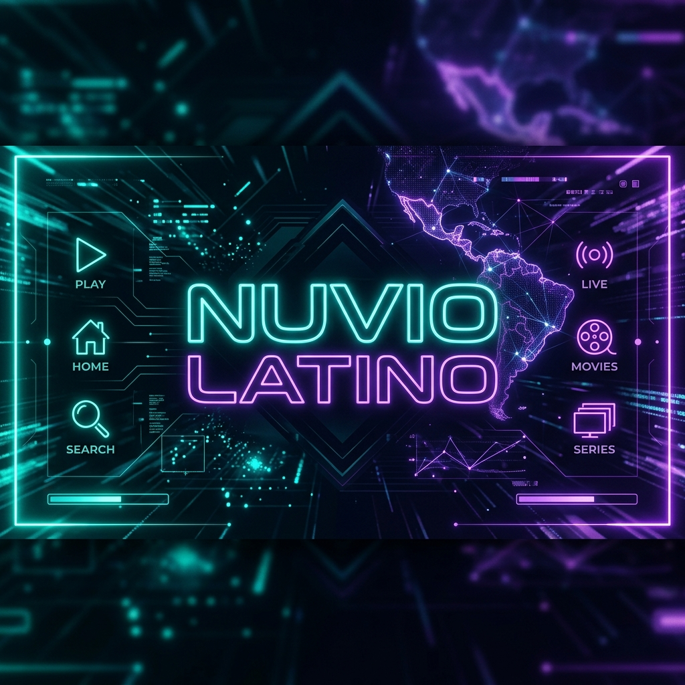

<div align="center">
  
  # Proveedores Latino para Nuvio

  [](https://github.com/latinokodi/latinuvio-V2)
  [](https://github.com/latinokodi/latinuvio-V2)
  [](https://github.com/latinokodi/latinuvio-V2)

  Colección de 37 proveedores HTTP optimizados en **Español Latino y Castellano** para la aplicación **Nuvio**.

</div>

---

## Características Principales

*   **Velocidad de Búsqueda**: Resolución ágil de enlaces en alta velocidad.
*   **Filtrado Estricto de Calidad**: Priorización de enlaces estables en resoluciones HD y superiores (1080p, 4K).
*   **Mantenimiento Continuo**: Estructuras limpias y resolvers optimizados contra caídas y restricciones.

---

## Instalación

Para agregar este proyecto a tu aplicación Nuvio, sigue estos pasos:

1. Abre la aplicación **Nuvio** en tu dispositivo.
2. Dirígete a la sección de **Configuración**.
3. Ve al apartado de **Proveedores** o **Addons**.
4. Selecciona la opción para **Importar Manifest / Agregar Repositorio** y pega la siguiente URL:

```text
https://raw.githubusercontent.com/latinokodi/latinuvio-V2/main/manifest.json
```

5. Los módulos se activarán automáticamente para realizar la búsqueda de contenido.

---

## Ecosistema

Este repositorio es parte del ecosistema Latino para Nuvio:

-   **[Nuvio TV](https://github.com/NuvioMedia/NuvioTV)** — Aplicación oficial para Android TV
-   **[Nuvio Mobile](https://github.com/NuvioMedia/NuvioMobile)** — Aplicación oficial para iOS y Android
-   **[Nuvio Web](https://github.com/NuvioMedia/NuvioWeb)** — Versión web para Smart TVs (webOS, Tizen)

Visita **[latinokodi.site](https://latinokodi.site)** para tutoriales, comunidad y soporte.

---

## Descargo de Responsabilidad (Disclaimer)

Este proyecto y sus scrapers son herramientas independientes creadas exclusivamente con fines educativos y de desarrollo.
- **Alojamiento de contenido**: Este repositorio **no** aloja, almacena, transmite ni distribuye ningún tipo de archivo multimedia, video o audio en sus servidores. Todos los resolvers y enlaces de streaming presentados son proveídos y hospedados por servidores y plataformas de terceros externas a este proyecto.
- **Responsabilidad de Uso**: Los autores y colaboradores de este software no asumen responsabilidad alguna por el uso final que los usuarios hagan de este material ni por la estabilidad o legitimidad de los enlaces obtenidos de fuentes de terceros. El uso de estos proveedores queda bajo el propio riesgo y criterio del usuario final.
